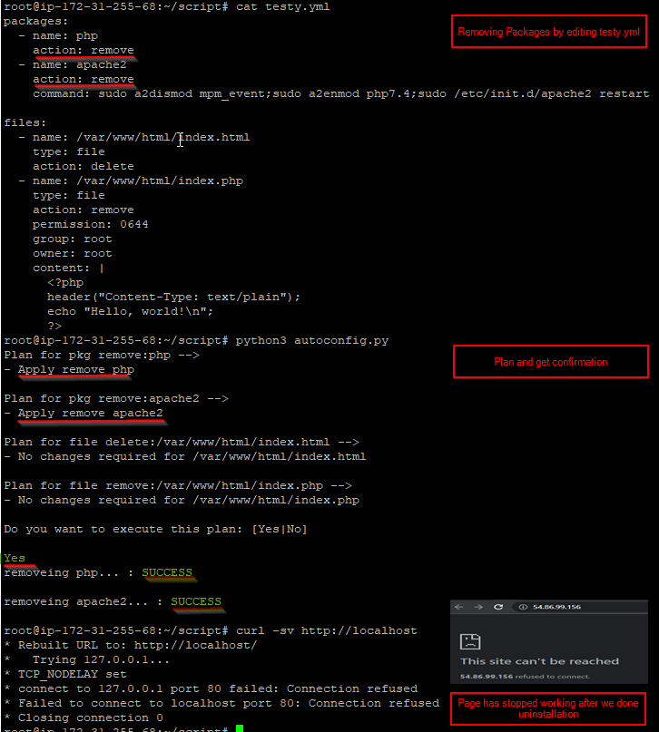
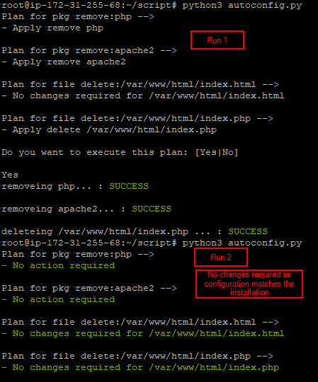

### Rudimentary configuration management tool (rCAT)


#### Context
- Construct a rudimentary configuration management tool and use it to configure two servers for production service of a simple PHP web application. 
- You are not allowed to use off-the-shelf tools like (but not limited to) Puppet, Chef, Fabric, or Ansible.
- Instead, we would like you to implement a tool a bit like Puppet or Chef that meets the following specifications and then use that tool to configure the two servers.

#### Tasks
* If your tool has dependencies not available on a standard Ubuntu instance you may include a bootstrap.sh program to resolve them

* Your tool must provide an abstraction that allows specifying a file's content and metadata (owner, group, mode)

 * Your tool must provide an abstraction that allows installing and removing Debian packages

 * Your tool must provide some mechanism for restarting a service when relevant files or packages are updated

* Your tool must be idempotent - it must be safe to apply your configuration over and over again

 * Don't forget to document the basic architecture of your tool, how to install it, how to write configurations, and how to invoke them
 
 * Your configuration must specify a web server capable of running the PHP application below

 * Both servers must respond 200 OK and include the string "Hello, world!" in their response to requests from curl -sv  http://(using the public IP address)

Here is the PHP application in question:

```php
<?php

header("Content-Type: text/plain");

echo "Hello, world!\n";
?>
```

### Technology Stack
Python 3 and core modules

### Features
abstraction that allows specifying a file's content and metadata (owner, group, mode)
abstraction that allows installing and removing Debian packages
mechanism for restarting a service when relevant files or packages are updated
Idempotent , safe to apply your configuration over and over again

### How to Run
- Copy python script from repo and create yaml file as given below
```yaml
#testy.yaml
packages:
  - name: php
    action: add
  - name: apache2
    action: add
    command: sudo a2dismod mpm_event;sudo a2enmod php*;sudo /etc/init.d/apache2 restart

files:
  - name: /var/www/html/index.html
    type: file
    action: delete
  - name: /var/www/html/index.php
    type: file
    action: create
    permission: 0644
    group: root
    owner: root
    content: |
      <?php
      header("Content-Type: text/plain");
      echo "Hello, world!\n";
      ?>
```
- Sample Run #1 : Creating resources from scratch


- Sample Run #2: Delete resources 



- Sample Run #3: Showing idempotent nature of execution




### Flow diagram


